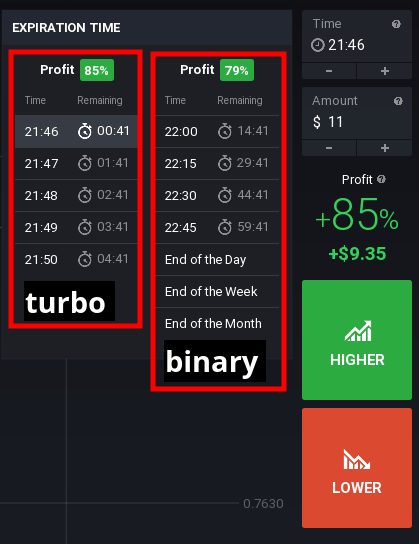
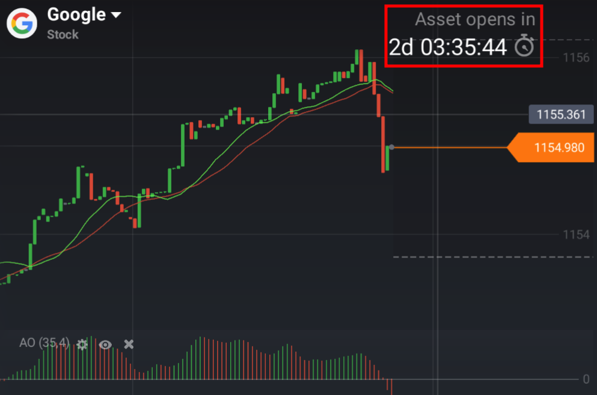
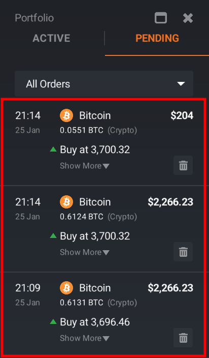
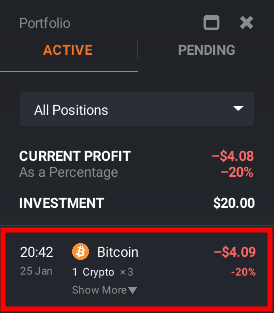
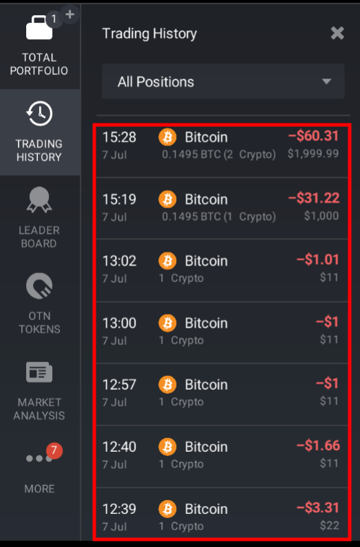
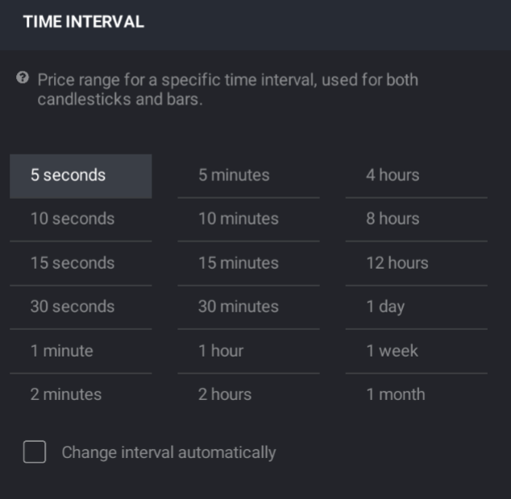

# IQ Option API

[](https://travis-ci.org/Lu-Yi-Hsun/iqoptionapi)
[](https://codecov.io/gh/Lu-Yi-Hsun/iqoptionapi)

[](https://www.paypal.me/iqoptionapi)

last update:2019/10/23

Version:4.0.1

fix get_positions()
https://github.com/Lu-Yi-Hsun/iqoptionapi/issues/132

add get_optioninfo_v2


Version:4.0.0

:exclamation::exclamation::exclamation:
update websocket-client==0.56
:exclamation:
please uninstall all websocket-client and update up websocket-client==0.56
```
sudo pip uninstall websocket-client
sudo pip install websocket-client==0.56
```
:exclamation:

Version:3.9.8

add [reset_practice_balance](#resetpracticebalance) api


Version:3.9.7

fix buy_digital_spot duration 5&15

fix check binary option open
if asset is close is may return "False" !!or!! "{}"
if asset is open is return "True"
https://github.com/Lu-Yi-Hsun/iqoptionapi/issues/122


Version:3.9.6

add [get_digital_current_profit](#getdigitalcurrentprofit)

https://github.com/Lu-Yi-Hsun/iqoptionapi/issues/121#issuecomment-539793386

Version:3.9.5

fix check_win_digital_v2

https://github.com/Lu-Yi-Hsun/iqoptionapi/issues/126

Version:3.9.4

fix version problem


Version:3.9.3

change and fix close digit(close_position) to close_digital_option

fix buy_digital problem

get_order only work for forex..., digital not work

fix close_position api for forex...

fix binary option buy api support python2&python3

 

Version:3.9.2

[fix buy() for support OS:window](#buy)


Version:3.9.1

please update to 3.9.1

Before Version 3.9.1 the buy() API active buy "realmode money" in "practice MODE" without call  change_balance("REAL") API.   Cause lose real money

[fix buy()](#buy)

Version:3.9

fix duration time

[change buy api: remove force_buy&!!!fix duration time!!](#buy)

[fix buy_digital_spot() error problem](#buydigitalspot)

Version:3.8.2

[fix digital check win return&add sample code](#checkwindigitalv2)

Version:3.8.1

[fix buy current price](#buydigitalspot)

[Check Asset if open or not](#checkopen)

[fix digital check win](#checkwindigitalv2)

[better !! get_position_history_v2](#getpositionhistoryv2)


Version:3.7
[buy current price](#buydigitalspot)

[change strike_list api](#strikelist)
need duration time
```python
subscribe_strike_list(ACTIVES,duration)
unsubscribe_strike_list(ACTIVES,duration)
``` 


---
## About API

only support US Dollar account

https://github.com/Lu-Yi-Hsun/iqoptionapi/issues/73#issue-406537365

```python
#hight level api ,This api is write base on ""iqoptionapi.api" for more easy
from iqoptionapi.stable_api import IQ_Option
#low level api
from iqoptionapi.api import IQOptionAPI
```
```bash
.
├── docs
├── iqoptionapi(API code)
    ├── http(doing http get/post)
    └── ws
        ├── chanels(Doing websocket action)
        └── objects(Get back data from websocket action)
```


## Can not loging problem

#### fix way 1 
```bash
sudo pip3 uninstall websocket-client
sudo pip3 install websocket-client==0.56
```

 

### problem 2

#### websocket conflict with websocket-client

if you have this problem

https://github.com/Lu-Yi-Hsun/iqoptionapi/issues/66

fix way
```bash
sudo pip3 uninstall websocket
sudo pip3 install websocket-client==0.47.0
```

---

## Installation & GET new version
For Python3
```bash
sudo pip3 install -U git+git://github.com/Lu-Yi-Hsun/iqoptionapi.git
```
For Python2
```bash
sudo pip2 install -U git+git://github.com/Lu-Yi-Hsun/iqoptionapi.git
```
---
## Littile sample
```python
import time
from iqoptionapi.stable_api import IQ_Option
I_want_money=IQ_Option("email","password")
goal="EURUSD"
print("get candles")
print(I_want_money.get_candles(goal,60,111,time.time()))
```

---

## Document

### Import 
```python
from iqoptionapi.stable_api import IQ_Option
```
---
### Debug mode on

```python
import logging
logging.basicConfig(level=logging.DEBUG,format='%(asctime)s %(message)s')
```
---
### Login
!!!

Login NOT support SMS Authorization yet

I suggest close it because your robot will stop to wait you to check sms code (on phone)....

!!!

```python
I_want_money=IQ_Option("email","password")
```

---
### <a id=setmaxreconnect>set_max_reconnect</a>
default number is 5

https://github.com/Lu-Yi-Hsun/iqoptionapi/issues/22

Protect if you get some error (iqoptionapi auto reconnect) too many time,IQoption will ban your IP

```
I_want_money.set_max_reconnect(number)
```

---
### Reconnect&check connect

some time connect will close so this way can check connect and reconnect

sample

```python
I_want_money=IQ_Option("email","password")
#check if connect
if I_want_money.check_connect()==False:
    I_want_money.connect()#if not connect it will reconnect
```

 
 
---
### Check version

```python
from iqoptionapi.stable_api import IQ_Option
print(IQ_Option.__version__)
```
### <a id=checkconnect> Check connect</a>

return True/False

```python
print(I_want_money.check_connect())
```

### <a id=reconnect>Reconnect</a>
```python
I_want_money.connect()
```
---

### <a id=checkopen>Check Asset if open or not</a>

:exclamation:be careful get_all_open_time() is very heavy for network.

get_all_open_time() return the DICT

"cfd" is include Stock,Commodities,ETFs asset

DICT["forex"/"cfd"/"crypto"/"digital"/"turbo"/"binary"][Asset Name]["open"]

it will return True/False
 
```python
from iqoptionapi.stable_api import IQ_Option
import logging
import random
logging.basicConfig(level=logging.DEBUG,format='%(asctime)s %(message)s')
I_want_money=IQ_Option("email","password")
ALL_Asset=I_want_money.get_all_open_time()
#check if open or not
print(ALL_Asset["forex"]["EURUSD"]["open"]) 
print(ALL_Asset["cfd"]["FACEBOOK"]["open"])#Stock,Commodities,ETFs
print(ALL_Asset["crypto"]["BTCUSD-L"]["open"])
print(ALL_Asset["digital"]["EURUSD-OTC"]["open"])

#Binary have two diffenence type:"turbo","binary"
print(ALL_Asset["turbo"]["EURUSD-OTC"]["open"])
print(ALL_Asset["binary"]["EURUSD-OTC"]["open"])


#!!!! exception ""
print(ALL_Asset["binary"]["not exist asset"]["open"])#it will return "{}" a None of the dict

#!!!!print all!!!!
for type_name, data in ALL_Asset.items():
    for Asset,value in data.items():
        print(type_name,Asset,value["open"])
```

### View all ACTIVES Name
you will get right all ACTIVES and code

[ACTIVES](iqoptionapi/constants.py)

```python
print(I_want_money.get_all_ACTIVES_OPCODE())
```

---
 

### For Options

#### <a id=buy>BUY</a>

Sample
```python
from iqoptionapi.stable_api import IQ_Option
import logging
import time
logging.basicConfig(level=logging.DEBUG,format='%(asctime)s %(message)s')
I_want_money=IQ_Option("email","pass")
goal="EURUSD"
print("get candles")
print(I_want_money.get_candles(goal,60,111,time.time()))
Money=1
ACTIVES="EURUSD"
ACTION="call"#or "put"
expirations_mode=1

I_want_money.buy(Money,ACTIVES,ACTION,expirations_mode)
```

```python
I_want_money.buy(Money,ACTIVES,ACTION,expirations)
                #Money:How many you want to buy type(int)
                #ACTIVES:sample input "EURUSD" OR "EURGBP".... you can view by get_all_ACTIVES_OPCODE
                #ACTION:"call"/"put" type(str)
                #expirations:input minute,careful too large will false to buy(Closed market time)thank Darth-Carrotpie's code (int)https://github.com/Lu-Yi-Hsun/iqoptionapi/issues/6
                #return:(None/id_number):if sucess return (id_number) esle return(None) 2.1.5 change this 
```
#### <a id=buymulti>buy_multi</a>

Sample
```python
from iqoptionapi.stable_api import IQ_Option
I_want_money=IQ_Option("email","password")
Money=[]
ACTIVES=[]
ACTION=[]
expirations_mode=[]

Money.append(1)
ACTIVES.append("EURUSD")
ACTION.append("call")#put
expirations_mode.append(1)

Money.append(1)
ACTIVES.append("EURAUD")
ACTION.append("call")#put
expirations_mode.append(1)

print("buy multi")
id_list=I_want_money.buy_multi(Money,ACTIVES,ACTION,expirations_mode)

print("check win only one id (id_list[0])")
print(I_want_money.check_win_v2(id_list[0]))
```


#### <a id=selloption>sell_option</a>

```python
I_want_money.sell_option(sell_all)#input int or list
```

Sample

```python
from iqoptionapi.stable_api import IQ_Option
import time
print("login...")
I_want_money=IQ_Option("email","password")

Money=1
ACTIVES="EURUSD"
ACTION="call"#or "put"
expirations_mode=1

id=I_want_money.buy(Money,ACTIVES,ACTION,expirations_mode)
id2=I_want_money.buy(Money,ACTIVES,ACTION,expirations_mode)

time.sleep(5)
sell_all=[]
sell_all.append(id)
sell_all.append(id2)
print(I_want_money.sell_option(sell_all))
```
#### check win

(only for option)

It will do loop until get win or loose

:exclamation:

it have a little problem when network close and reconnect miss get "listInfoData"

this function will doing Infinity loop

```python
I_want_money.check_win(23243221)
#""you need to get id_number from buy function""
#I_want_money.check_win(id_number)
#this function will do loop check your bet until if win/equal/loose
```
##### check_win_v2

(only for option)

more better way

an other way to fix that(implement by get_betinfo)

input by int

```python
I_want_money.check_win_v2(23243221)
#""you need to get id_number from buy function""
#I_want_money.check_win_v2(id_number)
#this function will do loop check your bet until if win/equal/loose
```

---
"get_binary_option_detail" and "get_all_profit" are base on "get_all_init()",if you want raw data you can call
```python
I_want_money.get_all_init()
```

---

<a id=expirationtime></a>



#### get_binary_option_detail

sample 
```python
from iqoptionapi.stable_api import IQ_Option
print("login...")
I_want_money=IQ_Option("email","password")
d=I_want_money.get_binary_option_detail()
print(d["CADCHF"]["turbo"])
print(d["CADCHF"]["binary"])
```

#### get all profit
sample 
```python
from iqoptionapi.stable_api import IQ_Option
print("login...")
I_want_money=IQ_Option("email","password")
d=I_want_money.get_all_profit()
print(d["CADCHF"]["turbo"])
print(d["CADCHF"]["binary"])
```
---
#### get_betinfo

(only for option)

it will get infomation about Bet by "id"

:exclamation:

if your bet(id) not have answer yet(game_state) or wrong id it will return False
input by int

```python
 
isSuccessful,dict=I_want_money.get_betinfo(4452272449)
#I_want_money.get_betinfo 
#INPUT: int
#OUTPUT:isSuccessful,dict

```
#### <a id=optioninfo>get_optioninfo</a>

input how many data you want to get from Trading History(only for binary option)

```
print(I_want_money.get_optioninfo(10))
```
#### <a id=optioninfo>get_optioninfo_v2</a>

input how many data you want to get from Trading History(only for binary option)

```
print(I_want_money.get_optioninfo_v2(10))
```

___
---
### <a id=digital>For Digital</a>
[Digital options buy with actual price sample code](https://github.com/Lu-Yi-Hsun/iqoptionapi/issues/65#issuecomment-511660908)

#### Sample

```python
from iqoptionapi.stable_api import IQ_Option
import time
import random
I_want_money=IQ_Option("email","password")

ACTIVES="EURUSD"
duration=1#minute 1 or 5
amount=1
I_want_money.subscribe_strike_list(ACTIVES,duration)
#get strike_list
data=I_want_money.get_realtime_strike_list(ACTIVES, duration)
print("get strike data")
print(data)
"""data
{'1.127100': 
    {  'call': 
            {   'profit': None, 
                'id': 'doEURUSD201811120649PT1MC11271'
            },   
        'put': 
            {   'profit': 566.6666666666666, 
                'id': 'doEURUSD201811120649PT1MP11271'
            }	
    }............
} 
"""
#get price list
price_list=list(data.keys())
#random choose Strategy
choose_price=price_list[random.randint(0,len(price_list)-1)]
#get instrument_id
instrument_id=data[choose_price]["call"]["id"]
#get profit
profit=data[choose_price]["call"]["profit"]
print("choose you want to buy")
print("price:",choose_price,"side:call","instrument_id:",instrument_id,"profit:",profit)
#put instrument_id to buy
buy_check,id=I_want_money.buy_digital(amount,instrument_id)
if buy_check:
    print("wait for check win")
    #check win
    while True:
        check_close,win_money=I_want_money.check_win_digital_v2(id)
        if check_close:
            if float(win_money)>0:
                win_money=("%.2f" % (win_money))
                print("you win",win_money,"money")
            else:
                print("you loose")
            break
    I_want_money.unsubscribe_strike_list(ACTIVES,duration)
else:
    print("fail to buy,please run again")
```
#### <a id=strikelist>Get all strike list data</a>

##### Data format

```python

{'1.127100': {  'call': {'profit': None, 'id': 'doEURUSD201811120649PT1MC11271'},   'put': {'profit': 566.6666666666666, 'id': 'doEURUSD201811120649PT1MP11271'}	}.......}  
```

##### sample

```python
from iqoptionapi.stable_api import IQ_Option
import time
I_want_money=IQ_Option("email","password")
ACTIVES="EURUSD"
duration=1#minute 1 or 5
I_want_money.subscribe_strike_list(ACTIVES,duration)
while True:
    data=I_want_money.get_realtime_strike_list(ACTIVES, duration)
    for price in data:
        print("price",price,data[price])
    time.sleep(5)
I_want_money.unsubscribe_strike_list(ACTIVES,duration)
```

#### <a id=buydigitalspot>buy_digital_spot</a>

buy the digit in current price

```python
from iqoptionapi.stable_api import IQ_Option
 
I_want_money=IQ_Option("email","password")

ACTIVES="EURUSD"
duration=1#minute 1 or 5
amount=1
action="call"#put
print(I_want_money.buy_digital_spot(ACTIVES,amount,action,duration))
```
#### <a id=getdigitalcurrentprofit>get_digital_current_profit</a>

get current price profit


```python
from iqoptionapi.stable_api import IQ_Option
import time
import logging
#logging.basicConfig(level=logging.DEBUG,format='%(asctime)s %(message)s')
I_want_money=IQ_Option("email","password")
ACTIVES="EURUSD"
duration=1#minute 1 or 5
I_want_money.subscribe_strike_list(ACTIVES,duration)
while True:
    data=I_want_money.get_digital_current_profit(ACTIVES, duration)
    print(data)#from first print it may be get false,just wait a second you can get the profit
    time.sleep(1)
I_want_money.unsubscribe_strike_list(ACTIVES,duration)
```

#### Buy digit
```python
buy_check,id=I_want_money.buy_digital(amount,instrument_id)
#get instrument_id from I_want_money.get_realtime_strike_list
```
#### check win for digital

##### check_win_digital
:exclamation::exclamation: this api may not working

```python
I_want_money.check_win_digital(id)#get the id from I_want_money.buy_digital
#return:check_close,win_money
#return sample
#if you loose:Ture,o
#if you win:True,1232.3
#if trade not clode yet:False,None
```
##### <a id=checkwindigitalv2>check_win_digital_v2</a>
 
:exclamation::exclamation: this api is asynchronous get id data,it only can get id data before you call the buy action. if you restart the program,the asynchronous id data can not get again,so check_win_digital_v2 may not working.

```python
I_want_money.check_win_digital_v2(id)#get the id from I_want_money.buy_digital
#return:check_close,win_money
#return sample
#if you loose:Ture,o
#if you win:True,1232.3
#if trade not clode yet:False,None
```

sample code

```python
from iqoptionapi.stable_api import IQ_Option
import logging
import random
import time
import datetime
#logging.basicConfig(level=logging.DEBUG,format='%(asctime)s %(message)s')
I_want_money=IQ_Option("email","password")


ACTIVES="EURUSD"
duration=1#minute 1 or 5
amount=1
action="call"#put
id=(I_want_money.buy_digital_spot(ACTIVES,amount,action,duration))
print(id)
if id !="error":
    while True:
        check,win=I_want_money.check_win_digital_v2(id)
        if check==True:
            break
    if win<0:
        print("you loss "+str(win)+"$")
    else:
        print("you win "+str(win)+"$")
else:
    print("please try again")
```


#### close digital
```python
I_want_money.close_digital_option(id)
```
#### get digital data
```python
#print(I_want_money.get_order(id))#not work for digital
print(I_want_money.get_positions("digital-option"))
print(I_want_money.get_position_history("digital-option"))
```


---
### <a id=forex>For Forex&Stock&Commodities&Crypto&ETFs</a>

#### you need to check Asset is open or close!

try this api [get_all_open_time](#checkopen)



#### <a id=instrumenttypeid>About instrument_type and instrument_id</a>

you can search instrument_type and instrument_id from this file

[search instrument_type and instrument_id](instrument.txt)
 

#### Sample
```python
from iqoptionapi.stable_api import IQ_Option
I_want_money=IQ_Option("email","password")

instrument_type="crypto"
instrument_id="BTCUSD"
side="buy"#input:"buy"/"sell"
amount=1.23#input how many Amount you want to play

#"leverage"="Multiplier"
leverage=3#you can get more information in get_available_leverages()

type="market"#input:"market"/"limit"/"stop"

#for type="limit"/"stop"

# only working by set type="limit"
limit_price=None#input:None/value(float/int)

# only working by set type="stop"
stop_price=None#input:None/value(float/int)

#"percent"=Profit Percentage
#"price"=Asset Price
#"diff"=Profit in Money

stop_lose_kind="percent"#input:None/"price"/"diff"/"percent"
stop_lose_value=95#input:None/value(float/int)

take_profit_kind=None#input:None/"price"/"diff"/"percent"
take_profit_value=None#input:None/value(float/int)

#"use_trail_stop"="Trailing Stop"
use_trail_stop=True#True/False

#"auto_margin_call"="Use Balance to Keep Position Open"
auto_margin_call=False#True/False
#if you want "take_profit_kind"&
#            "take_profit_value"&
#            "stop_lose_kind"&
#            "stop_lose_value" all being "Not Set","auto_margin_call" need to set:True

use_token_for_commission=False#True/False

check,order_id=I_want_money.buy_order(instrument_type=instrument_type, instrument_id=instrument_id,
            side=side, amount=amount,leverage=leverage,
            type=type,limit_price=limit_price, stop_price=stop_price,
            stop_lose_value=stop_lose_value, stop_lose_kind=stop_lose_kind,
            take_profit_value=take_profit_value, take_profit_kind=take_profit_kind,
            use_trail_stop=use_trail_stop, auto_margin_call=auto_margin_call,
            use_token_for_commission=use_token_for_commission)
print(I_want_money.get_order(order_id)) 
print(I_want_money.get_positions("crypto"))
print(I_want_money.get_position_history("crypto"))
print(I_want_money.get_available_leverages("crypto","BTCUSD"))
print(I_want_money.close_position(order_id))
print(I_want_money.get_overnight_fee("crypto","BTCUSD"))
```
 


#### Buy

return (True/False,buy_order_id/False)

if Buy sucess return (True,buy_order_id)

"percent"=Profit Percentage

"price"=Asset Price

"diff"=Profit in Money

|parameter|||||
--|--|--|--|--|
instrument_type|[instrument_type](#instrumenttypeid)
instrument_id| [instrument_id](#instrumenttypeid)
side|"buy"|"sell"
amount|value(float/int)
leverage|value(int)
type|"market"|"limit"|"stop"
limit_price|None|value(float/int):Only working by set type="limit"
stop_price|None|value(float/int):Only working by set type="stop"
stop_lose_kind|None|"price"|"diff"|"percent"
stop_lose_value|None|value(float/int)
take_profit_kind|None|"price"|"diff"|"percent"
take_profit_value|None|value(float/int)
use_trail_stop|True|False
auto_margin_call|True|False
use_token_for_commission|True|False

```python
check,order_id=I_want_money.buy_order(
            instrument_type=instrument_type, instrument_id=instrument_id,
            side=side, amount=amount,leverage=leverage,
            type=type,limit_price=limit_price, stop_price=stop_price,
            stop_lose_kind=stop_lose_kind,
            stop_lose_value=stop_lose_value,
            take_profit_kind=take_profit_kind,
            take_profit_value=take_profit_value,
            use_trail_stop=use_trail_stop, auto_margin_call=auto_margin_call,
            use_token_for_commission=use_token_for_commission)

```
#### <a id=changeorder>change_order</a>

##### change PENDING


##### change Position


|parameter|||||
--|--|--|--|--|
ID_Name|"position_id"|"order_id"
order_id|"you need to get order_id from buy_order()"
stop_lose_kind|None|"price"|"diff"|"percent"
stop_lose_value|None|value(float/int)
take_profit_kind|None|"price"|"diff"|"percent"
take_profit_value|None|value(float/int)
use_trail_stop|True|False
auto_margin_call|True|False


##### sample
```python
ID_Name="order_id"#"position_id"/"order_id"
stop_lose_kind=None
stop_lose_value=None
take_profit_kind="percent"
take_profit_value=200
use_trail_stop=False
auto_margin_call=True
I_want_money.change_order(ID_Name=ID_Name,order_id=order_id,
                stop_lose_kind=stop_lose_kind,stop_lose_value=stop_lose_value,
                take_profit_kind=take_profit_kind,take_profit_value=take_profit_value,
                use_trail_stop=use_trail_stop,auto_margin_call=auto_margin_call)
```

---


#### get_order

 
get infomation about buy_order_id

return (True/False,get_order,None)

```python
I_want_money.get_order(buy_order_id)
```

#### get_pending
you will get there data



```python
I_want_money.get_pending(instrument_type)
```
#### get_positions

you will get there data


return (True/False,get_positions,None)


:exclamation: not support ""turbo-option""

instrument_type="crypto","forex","fx-option","multi-option","cfd","digital-option"

```python
I_want_money.get_positions(instrument_type)
```

#### get_position
you will get there data



you will get one position by buy_order_id

return (True/False,position data,None)

```python
I_want_money.get_positions(buy_order_id)
```

#### get_position_history

you will get there data



return (True/False,position_history,None)

```python
I_want_money.get_position_history(instrument_type)
```
#### <a id=getpositionhistoryv2>get_position_history_v2</a>

instrument_type="crypto","forex","fx-option","turbo-option","multi-option","cfd","digital-option"

get_position_history_v2(instrument_type,limit,offset,start,end)

```python
from iqoptionapi.stable_api import IQ_Option
import logging
import random
import time
import datetime
logging.basicConfig(level=logging.DEBUG,format='%(asctime)s %(message)s')
I_want_money=IQ_Option("email","password")

#instrument_type="crypto","forex","fx-option","turbo-option","multi-option","cfd","digital-option"  
instrument_type="digital-option"
limit=2#How many you want to get
offset=0#offset from end time,if end time is 0,it mean get the data from now 
start=0#start time Timestamp
end=0#Timestamp
data=I_want_money.get_position_history_v2(instrument_type,limit,offset,start,end)

print(data)

#--------- this will get data start from 2019/7/1(end) to 2019/1/1(start) and only get 2(limit) data and offset is 0
instrument_type="digital-option"
limit=2#How many you want to get
offset=0#offset from end time,if end time is 0,it mean get the data from now 
start=int(time.mktime(datetime.datetime.strptime("2019/1/1", "%Y/%m/%d").timetuple()))
end=int(time.mktime(datetime.datetime.strptime("2019/7/1", "%Y/%m/%d").timetuple()))
data=I_want_money.get_position_history_v2(instrument_type,limit,offset,start,end)
print(data)

```

#### get_available_leverages

get available leverages

return (True/False,available_leverages,None)

```python
I_want_money.get_available_leverages(instrument_type,actives)
```
#### cancel_order

you will do this


return (True/False)

```python
I_want_money.cancel_order(buy_order_id)
```

#### close_position

you will do this


return (True/False)

```python
I_want_money.close_position(buy_order_id)
```

#### get_overnight_fee

return (True/False,overnight_fee,None)

```python
I_want_money.get_overnight_fee(instrument_type,active)
```
---
---

### Candle

#### get candles
:exclamation:

 get_candles can not get "real time data" ,it will late about 30sec

if you very care about real time you need use 

"get realtime candles" OR "collect realtime candles"

sample 

""now"" time 1:30:45sec

1.  you want to get  candles 1:30:45sec now
    
    you may get 1:30:15sec data have been late approximately 30sec

2.  you want to get  candles 1:00:33sec 

    you will get the right data

```python
I_want_money.get_candles(ACTIVES,interval,count,endtime)
            #ACTIVES:sample input "EURUSD" OR "EURGBP".... youcan
            #interval:duration of candles
            #count:how many candles you want to get from now to past
            #endtime:get candles from past to "endtime"
```
:exclamation:
try this code to get more than 1000 candle
```python
from iqoptionapi.stable_api import IQ_Option
import time
I_want_money=IQ_Option("email","password")
end_from_time=time.time()
ANS=[]
for i in range(70):
    data=I_want_money.get_candles("EURUSD", 60, 1000, end_from_time)
    ANS =data+ANS
    end_from_time=int(data[0]["from"])-1
print(ANS)
```

#### get realtime candles

##### Sample 
```python
from iqoptionapi.stable_api import IQ_Option
import logging
import time
#logging.basicConfig(level=logging.DEBUG,format='%(asctime)s %(message)s')
print("login...")
I_want_money=IQ_Option("email","password")
goal="EURUSD"
size="all"#size=[1,5,10,15,30,60,120,300,600,900,1800,3600,7200,14400,28800,43200,86400,604800,2592000,"all"]
maxdict=10
print("start stream...")
I_want_money.start_candles_stream(goal,size,maxdict)
#DO something
print("Do something...")
time.sleep(10)

print("print candles")
cc=I_want_money.get_realtime_candles(goal,size)
for k in cc:
    print(goal,"size",k,cc[k])
print("stop candle")
I_want_money.stop_candles_stream(goal,size)
```
 
##### start_candles_stream
 
* input:
    * goal:"EURUSD"...
    * size:[1,5,10,15,30,60,120,300,600,900,1800,3600,7200,14400,28800,43200,86400,604800,2592000,"all"]
    * maxdict:set max buffer you want to save

size



##### get_realtime_candles
* input:
    * goal:"EURUSD"...
    * size:[1,5,10,15,30,60,120,300,600,900,1800,3600,7200,14400,28800,43200,86400,604800,2592000,"all"]
* output:
    * dict
##### stop_candles_stream
* input:
    * goal:"EURUSD"...
    * size:[1,5,10,15,30,60,120,300,600,900,1800,3600,7200,14400,28800,43200,86400,604800,2592000,"all"]

---
### time

#### <a id=timestamp> get_server_timestamp</a>
the get_server_timestamp time is sync with iqoption
```python
I_want_money.get_server_timestamp()
```

#### <a id=purchase>Purchase Time</a>
this sample get the Purchase time clock
```python
import time

#get the end of the timestamp by expiration time
def get_expiration_time(t):
    exp=time.time()#or I_want_money.get_server_timestamp() to get more Precision
    if (exp % 60) > 30:
        end = exp - (exp % 60) + 60*(t+1)
    else:
        end = exp - (exp % 60)+60*(t)
    return end
    
expiration_time=2

end_time=0
while True:
    if end_time-time.time()-30<=0:
        end_time = get_expiration_time(expiration_time)
    print(end_time-time.time()-30)
    time.sleep(1)
```

---
### Get mood

Sample

```python
from iqoptionapi.stable_api import IQ_Option
I_want_money=IQ_Option("email","password")
goal="EURUSD"
I_want_money.start_mood_stream(goal)
print(I_want_money.get_traders_mood(goal))
I_want_money.stop_mood_stream(goal)
```

#### get_traders_mood


get  percent of higher(call)

if you want to know percent of lower(put) just 1-higher
```python
I_want_money.get_traders_mood(goal)
#input:input "EURUSD" OR "EURGBP".... you can view by get_all_ACTIVES_OPCODE
#output:(float) the higher(call)%
#if you want to know lower(put)% try 1-I_want_money.get_traders_mood(goal)
```
#### get_all_traders_mood
get all you start mood
```python
I_want_money.get_all_traders_mood(goal)
#output:(dict) all mood you start
```

### Account

#### get balance
```python
I_want_money.get_balance()
```

 
#### <a id=resetpracticebalance>reset practice balance</a>

reset practice balance to $10000

```python
from iqoptionapi.stable_api import IQ_Option
I_want_money=IQ_Option("email","password")
print(I_want_money.reset_practice_balance())
```

#### Change real/practice Account
```python
I_want_money.change_balance(MODE)
                        #MODE: "PRACTICE"/"REAL"
```

---


 
 
    
