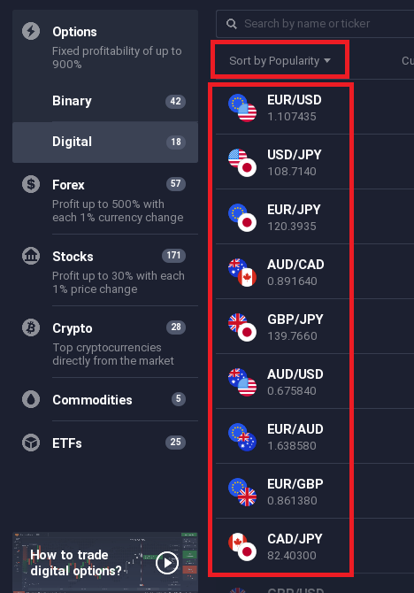

# For all

this api can work for option&digital&Forex&Stock&Commodities&Crypto&ETFs

## Check Asset if open or not

be careful get_all_open_time() is very heavy for network.

get_all_open_time() return the DICT

"cfd" is include Stock,Commodities,ETFs asset

DICT["forex"/"cfd"/"crypto"/"digital"/"turbo"/"binary"][Asset Name]["open"]

it will return True/False

```python
from iqoptionapi.stable_api import IQ_Option
import logging
import random
logging.basicConfig(level=logging.DEBUG,format='%(asctime)s %(message)s')
I_want_money=IQ_Option("email","password")
I_want_money.connect()#connect to iqoption
ALL_Asset=I_want_money.get_all_open_time()
#check if open or not
print(ALL_Asset["forex"]["EURUSD"]["open"]) 
print(ALL_Asset["cfd"]["FACEBOOK"]["open"])#Stock,Commodities,ETFs
print(ALL_Asset["crypto"]["BTCUSD-L"]["open"])
print(ALL_Asset["digital"]["EURUSD-OTC"]["open"])

#Binary have two diffenence type:"turbo","binary"
print(ALL_Asset["turbo"]["EURUSD-OTC"]["open"])
print(ALL_Asset["binary"]["EURUSD-OTC"]["open"])


#!!!! exception ""
print(ALL_Asset["binary"]["not exist asset"]["open"])#it will return "{}" a None of the dict

#!!!!print all!!!!
for type_name, data in ALL_Asset.items():
    for Asset,value in data.items():
        print(type_name,Asset,value["open"])
```

## View all ACTIVES Name

```
print(I_want_money.get_all_ACTIVES_OPCODE())
```
##  update ACTIVES OPCODE
```
I_want_money.update_ACTIVES_OPCODE()
```
## get_async_order()

```python
from iqoptionapi.stable_api import IQ_Option
import logging
import time
#logging.basicConfig(level=logging.DEBUG,format='%(asctime)s %(message)s')
I_want_money=IQ_Option("email","password")
I_want_money.connect()#connect to iqoption
ACTIVES="EURUSD"
duration=1#minute 1 or 5
amount=1
action="call"#put

print("__For_Binary_Option__")
_,id=I_want_money.buy(amount,ACTIVES,action,duration)
while I_want_money.get_async_order(id)==None:
    pass
print(I_want_money.get_async_order(id))
print("\n\n")

print("__For_Digital_Option__spot")
_,id=I_want_money.buy_digital_spot(ACTIVES,amount,action,duration)
while I_want_money.get_async_order(id)==None:
    pass
order_data=I_want_money.get_async_order(id)
print(I_want_money.get_async_order(id))
print("\n\n")

print("__For_Forex_Stock_Commodities_Crypto_ETFs")
instrument_type="crypto"
instrument_id="BTCUSD"
side="buy"
amount=1.23
leverage=3
type="market"
limit_price=None 
stop_price=None 
stop_lose_kind="percent" 
stop_lose_value=95 
take_profit_kind=None 
take_profit_value=None 
use_trail_stop=True 
auto_margin_call=False 
use_token_for_commission=False 
check,id=I_want_money.buy_order(instrument_type=instrument_type, instrument_id=instrument_id,
            side=side, amount=amount,leverage=leverage,
            type=type,limit_price=limit_price, stop_price=stop_price,
            stop_lose_value=stop_lose_value, stop_lose_kind=stop_lose_kind,
            take_profit_value=take_profit_value, take_profit_kind=take_profit_kind,
            use_trail_stop=use_trail_stop, auto_margin_call=auto_margin_call,
            use_token_for_commission=use_token_for_commission)
while I_want_money.get_async_order(id)==None:
    pass
order_data=I_want_money.get_async_order(id)
print(I_want_money.get_async_order(id))
```

## get_commission_change()

instrument_type: "binary-option"/"turbo-option"/"digital-option"/"crypto"/"forex"/"cfd"

I_want_money.subscribe_commission_changed(instrument_type) I_want_money.get_commission_change(instrument_type) I_want_money.unsubscribe_commission_changed(instrument_type)

Sample code

```python
import time
from iqoptionapi.stable_api import IQ_Option
I_want_money=IQ_Option("email","password")
I_want_money.connect()#connect to iqoption
#instrument_type: "binary-option"/"turbo-option"/"digital-option"/"crypto"/"forex"/"cfd"
instrument_type=["binary-option","turbo-option","digital-option","crypto","forex","cfd"]
for ins in instrument_type:
    I_want_money.subscribe_commission_changed(ins)
print("Start stream please wait profit change...")
while True:
    for ins in instrument_type:
        commissio_data=I_want_money.get_commission_change(ins)
        if commissio_data!={}:
            for active_name in commissio_data:
                if commissio_data[active_name]!={}:
                    the_min_timestamp=min(commissio_data[active_name].keys())
                    commissio=commissio_data[active_name][the_min_timestamp]
                    profit=(100-commissio)/100
                    print("instrument_type: "+str(ins)+" active_name: "+str(active_name)+" profit change to: "+str(profit))
                    #Data have been update so need del
                    del I_want_money.get_commission_change(ins)[active_name][the_min_timestamp]
    time.sleep(1)
```


## Get top_assets_updated


### smaple 

instrument_type="binary-option"/"digital-option"/"forex"/"cfd"/"crypto"
```python
from iqoptionapi.stable_api import IQ_Option
import logging
import time
#logging.basicConfig(level=logging.DEBUG,format='%(asctime)s %(message)s')
I_want_money=IQ_Option("email","password")
I_want_money.connect()#connect to iqoption
instrument_type="digital-option"#"binary-option"/"digital-option"/"forex"/"cfd"/"crypto"
I_want_money.subscribe_top_assets_updated(instrument_type)

print("__Please_wait_for_sec__")
while True:
    if I_want_money.get_top_assets_updated(instrument_type)!=None:
        print(I_want_money.get_top_assets_updated(instrument_type))
        print("\n\n")
    time.sleep(1)
I_want_money.unsubscribe_top_assets_updated(instrument_type)
```
### subscribe_top_assets_updated()

```python
instrument_type="digital-option"#"binary-option"/"digital-option"/"forex"/"cfd"/"crypto"
I_want_money.subscribe_top_assets_updated(instrument_type)
```

### get_top_assets_updated()

need call get_top_assets_updated() after subscribe_top_assets_updated()
```python
I_want_money.get_top_assets_updated(instrument_type)
```


### unsubscribe_top_assets_updated()

if you not using please close stram for safe network

```python
I_want_money.unsubscribe_top_assets_updated(instrument_type)
```

### get sort by popularity 




#### sample 
```python
from iqoptionapi.stable_api import IQ_Option
import logging
import time
import operator
 
#logging.basicConfig(level=logging.DEBUG,format='%(asctime)s %(message)s')
def opcode_to_name(opcode_data,opcode):
    return list(opcode_data.keys())[list(opcode_data.values()).index(opcode)]            

I_want_money=IQ_Option("email","password")
I_want_money.connect()#connect to iqoption
I_want_money.update_ACTIVES_OPCODE()
opcode_data=I_want_money.get_all_ACTIVES_OPCODE()

instrument_type="digital-option"#"binary-option"/"digital-option"/"forex"/"cfd"/"crypto"
I_want_money.subscribe_top_assets_updated(instrument_type)


print("__Please_wait_for_sec__")
while True:
    if I_want_money.get_top_assets_updated(instrument_type)!=None:
        break

top_assets=I_want_money.get_top_assets_updated(instrument_type)
popularity={}
for asset in top_assets:
    opcode=asset["active_id"]
    popularity_value=asset["popularity"]["value"]
    try:
        name=opcode_to_name(opcode_data,opcode)
        popularity[name]=popularity_value
    except:
        pass
 
 
sorted_popularity = sorted(popularity.items(), key=operator.itemgetter(1))
print("__Popularity_min_to_max__")
for lis in sorted_popularity:
    print(lis)

I_want_money.unsubscribe_top_assets_updated(instrument_type)
```

## get_leader_board

Get leader board data

```python
from iqoptionapi.stable_api import IQ_Option
I_want_money=IQ_Option(email,password)
I_want_money.connect()#connect to iqoption
 
country="TW"
from_position=1
to_position=1
near_traders_count=0

print(I_want_money.get_leader_board(country,from_position,to_position,near_traders_count))
```

!!! country
    ID = {"Worldwide":0,
        "AF": 1,
        "AL": 2,
        "DZ": 3,
        "AD": 5,
        "AO": 6,
        "AI": 7,
        "AG": 9,
        "AR": 10,
        "AM": 11,
        "AW": 12,
        "AT": 14,
        "AZ": 15,
        "BS": 16,
        "BH": 17,
        "BD": 18,
        "BB": 19,
        "BY": 20,
        "BZ": 22,
        "BJ": 23,
        "BM": 24,
        "BO": 26,
        "BA": 27,
        "BW": 28,
        "BV": 29,
        "BR": 30,
        "BN": 31,
        "BG": 32,
        "BF": 33,
        "BI": 34,
        "KH": 35,
        "CM": 36,
        "CV": 38,
        "KY": 39,
        "TD": 41,
        "CL": 42,
        "CN": 43,
        "CC": 45,
        "CO": 46,
        "KM": 47,
        "CG": 48,
        "CK": 49,
        "CR": 50,
        "CI": 51,
        "HR": 52,
        "CU": 53,
        "CY": 54,
        "CZ": 55,
        "DK": 56,
        "DJ": 57,
        "DM": 58,
        "DO": 59,
        "TL": 60,
        "EC": 61,
        "EG": 62,
        "SV": 63,
        "EE": 66,
        "ET": 67,
        "FO": 69,
        "FJ": 70,
        "FI": 71,
        "FR": 72,
        "GF": 73,
        "PF": 74,
        "GA": 75,
        "GM": 76,
        "GE": 77,
        "DE": 78,
        "GH": 79,
        "GR": 81,
        "GD": 83,
        "GP": 84,
        "GT": 86,
        "GN": 87,
        "GY": 88,
        "HT": 89,
        "HN": 90,
        "HK": 91,
        "HU": 92,
        "IS": 93,
        "ID": 94,
        "IQ": 95,
        "IE": 96,
        "IT": 97,
        "JM": 98,
        "JO": 100,
        "KZ": 101,
        "KE": 102,
        "KI": 103,
        "KW": 104,
        "KG": 105,
        "LA": 106,
        "LV": 107,
        "LB": 108,
        "LS": 109,
        "LR": 110,
        "LY": 111,
        "LT": 113,
        "LU": 114,
        "MO": 115,
        "MK": 116,
        "MG": 117,
        "MW": 118,
        "MY": 119,
        "MV": 120,
        "ML": 121,
        "MT": 122,
        "MQ": 124,
        "MR": 125,
        "MU": 126,
        "MX": 128,
        "FM": 129,
        "MD": 130,
        "MC": 131,
        "MN": 132,
        "MA": 134,
        "MZ": 135,
        "MM": 136,
        "NA": 137,
        "NP": 139,
        "NL": 140,
        "AN": 141,
        "NC": 142,
        "NZ": 143,
        "NI": 144,
        "NE": 145,
        "NG": 146,
        "NO": 149,
        "OM": 150,
        "PK": 151,
        "PW": 152,
        "PA": 153,
        "PG": 154,
        "PY": 155,
        "PE": 156,
        "PH": 157,
        "PL": 159,
        "PT": 160,
        "QA": 162,
        "RE": 163,
        "RO": 164,
        "RW": 166,
        "KN": 167,
        "LC": 168,
        "SA": 171,
        "SN": 172,
        "SC": 173,
        "SG": 175,
        "SK": 176,
        "SI": 177,
        "SO": 179,
        "ZA": 180,
        "KR": 181,
        "ES": 182,
        "LK": 183,
        "SH": 184,
        "SR": 186,
        "SZ": 187,
        "SE": 188,
        "CH": 189,
        "TW": 191,
        "TJ": 192,
        "TZ": 193,
        "TH": 194,
        "TG": 195,
        "TT": 198,
        "TN": 199,
        "TR": 200,
        "TM": 201,
        "UG": 203,
        "UA": 204,
        "AE": 205,
        "GB": 206,
        "UY": 207,
        "UZ": 208,
        "VE": 211,
        "VN": 212,
        "VG": 213,
        "YE": 216,
        "ZM": 218,
        "ZW": 219,
        "RS": 220,
        "ME": 221,
        "IN": 225,
        "TC": 234,
        "CD": 235,
        "GG": 236,
        "IM": 237,
        "JE": 239,
        "CW": 246, }
