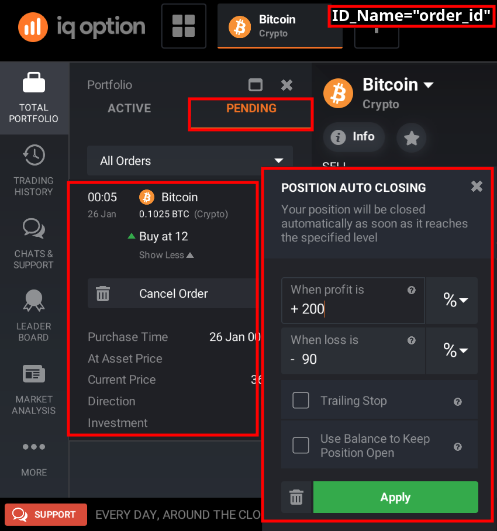
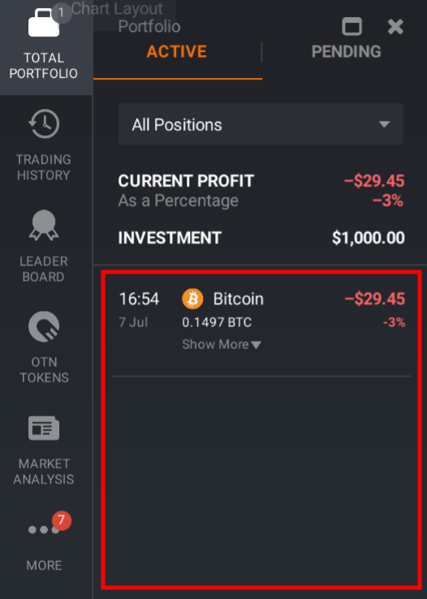
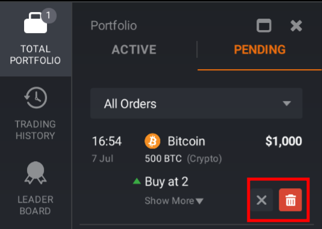
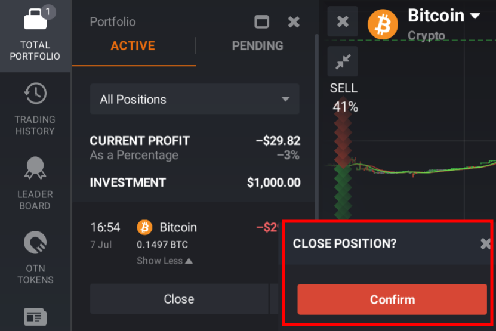

# Forex&Stock&Commodities&Crypto&ETFs

## instrument_type and instrument_id
you can search instrument_type and instrument_id from this file

search [instrument_type and instrument_id](instrument.txt)

## sample

```python
from iqoptionapi.stable_api import IQ_Option
I_want_money=IQ_Option("email","password")
I_want_money.connect()#connect to iqoption
instrument_type="crypto"
instrument_id="BTCUSD"
side="buy"#input:"buy"/"sell"
amount=1.23#input how many Amount you want to play

#"leverage"="Multiplier"
leverage=3#you can get more information in get_available_leverages()

type="market"#input:"market"/"limit"/"stop"

#for type="limit"/"stop"

# only working by set type="limit"
limit_price=None#input:None/value(float/int)

# only working by set type="stop"
stop_price=None#input:None/value(float/int)

#"percent"=Profit Percentage
#"price"=Asset Price
#"diff"=Profit in Money

stop_lose_kind="percent"#input:None/"price"/"diff"/"percent"
stop_lose_value=95#input:None/value(float/int)

take_profit_kind=None#input:None/"price"/"diff"/"percent"
take_profit_value=None#input:None/value(float/int)

#"use_trail_stop"="Trailing Stop"
use_trail_stop=True#True/False

#"auto_margin_call"="Use Balance to Keep Position Open"
auto_margin_call=False#True/False
#if you want "take_profit_kind"&
#            "take_profit_value"&
#            "stop_lose_kind"&
#            "stop_lose_value" all being "Not Set","auto_margin_call" need to set:True

use_token_for_commission=False#True/False

check,order_id=I_want_money.buy_order(instrument_type=instrument_type, instrument_id=instrument_id,
            side=side, amount=amount,leverage=leverage,
            type=type,limit_price=limit_price, stop_price=stop_price,
            stop_lose_value=stop_lose_value, stop_lose_kind=stop_lose_kind,
            take_profit_value=take_profit_value, take_profit_kind=take_profit_kind,
            use_trail_stop=use_trail_stop, auto_margin_call=auto_margin_call,
            use_token_for_commission=use_token_for_commission)
print(I_want_money.get_order(order_id)) 
print(I_want_money.get_positions("crypto"))
print(I_want_money.get_position_history("crypto"))
print(I_want_money.get_available_leverages("crypto","BTCUSD"))
print(I_want_money.close_position(order_id))
print(I_want_money.get_overnight_fee("crypto","BTCUSD"))
```

## buy_order()
return (True/False,buy_order_id/False)

if Buy sucess return (True,buy_order_id)

"percent"=Profit Percentage

"price"=Asset Price

"diff"=Profit in Money


|parameter|||||
--|--|--|--|--|
instrument_type|[instrument_type](#instrumenttypeid)
instrument_id| [instrument_id](#instrumenttypeid)
side|"buy"|"sell"
amount|value(float/int)
leverage|value(int)
type|"market"|"limit"|"stop"
limit_price|None|value(float/int):Only working by set type="limit"
stop_price|None|value(float/int):Only working by set type="stop"
stop_lose_kind|None|"price"|"diff"|"percent"
stop_lose_value|None|value(float/int)
take_profit_kind|None|"price"|"diff"|"percent"
take_profit_value|None|value(float/int)
use_trail_stop|True|False
auto_margin_call|True|False
use_token_for_commission|True|False

```python
check,order_id=I_want_money.buy_order(
            instrument_type=instrument_type, instrument_id=instrument_id,
            side=side, amount=amount,leverage=leverage,
            type=type,limit_price=limit_price, stop_price=stop_price,
            stop_lose_kind=stop_lose_kind,
            stop_lose_value=stop_lose_value,
            take_profit_kind=take_profit_kind,
            take_profit_value=take_profit_value,
            use_trail_stop=use_trail_stop, auto_margin_call=auto_margin_call,
            use_token_for_commission=use_token_for_commission)

```

## change_order()
ID_Name=""order_id" |  ID_Name="position_id"
:-------------------------:|:-------------------------:
  |  

 
|parameter|||||
--|--|--|--|--|
ID_Name|"position_id"|"order_id"
order_id|"you need to get order_id from buy_order()"
stop_lose_kind|None|"price"|"diff"|"percent"
stop_lose_value|None|value(float/int)
take_profit_kind|None|"price"|"diff"|"percent"
take_profit_value|None|value(float/int)
use_trail_stop|True|False
auto_margin_call|True|False

### sample

```python
ID_Name="order_id"#"position_id"/"order_id"
stop_lose_kind=None
stop_lose_value=None
take_profit_kind="percent"
take_profit_value=200
use_trail_stop=False
auto_margin_call=True
I_want_money.change_order(ID_Name=ID_Name,order_id=order_id,
                stop_lose_kind=stop_lose_kind,stop_lose_value=stop_lose_value,
                take_profit_kind=take_profit_kind,take_profit_value=take_profit_value,
                use_trail_stop=use_trail_stop,auto_margin_call=auto_margin_call)
```

## get_order()

get infomation about buy_order_id

return (True/False,get_order,None)

```python
I_want_money.get_order(buy_order_id)
```

## get_pending()

you will get there data


```python
I_want_money.get_pending(instrument_type)
```

## get_positions()

you will get there data




return (True/False,get_positions,None)

not support ""turbo-option""

instrument_type="crypto","forex","fx-option","multi-option","cfd","digital-option"

```python
I_want_money.get_positions(instrument_type)
```

## get_position()

you will get there data


you will get one position by buy_order_id

return (True/False,position data,None)

```python
I_want_money.get_positions(buy_order_id)
```

## get_position_history
you will get there data


### get_position_history()
 
return (True/False,position_history,None)

```
I_want_money.get_position_history(instrument_type)
```

### get_position_history_v2

instrument_type="crypto","forex","fx-option","turbo-option","multi-option","cfd","digital-option"

get_position_history_v2(instrument_type,limit,offset,start,end)

```python
from iqoptionapi.stable_api import IQ_Option
import logging
import random
import time
import datetime
logging.basicConfig(level=logging.DEBUG,format='%(asctime)s %(message)s')
I_want_money=IQ_Option("email","password")
I_want_money.connect()#connect to iqoption
#instrument_type="crypto","forex","fx-option","turbo-option","multi-option","cfd","digital-option"  
instrument_type="digital-option"
limit=2#How many you want to get
offset=0#offset from end time,if end time is 0,it mean get the data from now 
start=0#start time Timestamp
end=0#Timestamp
data=I_want_money.get_position_history_v2(instrument_type,limit,offset,start,end)

print(data)

#--------- this will get data start from 2019/7/1(end) to 2019/1/1(start) and only get 2(limit) data and offset is 0
instrument_type="digital-option"
limit=2#How many you want to get
offset=0#offset from end time,if end time is 0,it mean get the data from now 
start=int(time.mktime(datetime.datetime.strptime("2019/1/1", "%Y/%m/%d").timetuple()))
end=int(time.mktime(datetime.datetime.strptime("2019/7/1", "%Y/%m/%d").timetuple()))
data=I_want_money.get_position_history_v2(instrument_type,limit,offset,start,end)
print(data)
```

## get_available_leverages()

get available leverages

return (True/False,available_leverages,None)

```python
I_want_money.get_available_leverages(instrument_type,actives)
```

## cancel_order()

you will do this



return (True/False)

```python
I_want_money.cancel_order(buy_order_id)
```

## close_position()

you will do this



return (True/False)

```python
I_want_money.close_position(buy_order_id)
```

## get_overnight_fee()

return (True/False,overnight_fee,None)

```python
I_want_money.get_overnight_fee(instrument_type,active)
```